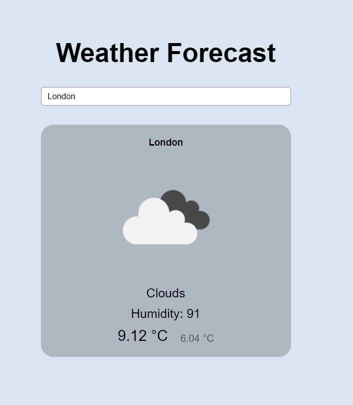

# Weather Forecast App

## Features

- Get current weather information by city name.
- Display temperature, weather conditions, humidity, and an icon representing the weather.
- Simple and intuitive user interface.

## Table of Contents

- [Demo](#demo)
- [Installation](#installation)
- [Usage](#usage)
- [Files Structure](#files-structure)
- [API](#api)
- [License](#license)

## Demo



## Installation

1. Clone the repository:
    ```bash
    git clone https://github.com/yourusername/weather-forecast-app.git
    ```
2. Navigate to the project directory:
    ```bash
    cd weather-forecast-app
    ```
3. Open `index.html` in your favorite web browser.

## Usage

1. Enter the name of the city in the search input field.
2. Press the `Enter` key to fetch and display the weather information.

## Files Structure

- `index.html`: The main HTML file that structures the web page.
- `styles.css`: The CSS file that contains styles for the app.
- `app.js`: The main JavaScript file that handles user input and interaction.
- `api_connection.js`: A JavaScript file that contains the function to make API calls to OpenWeatherMap.
- `displayWeather.js`: A JavaScript file that handles the display of the weather information.

## API

This app uses the OpenWeatherMap API to fetch weather data. You need to obtain an API key from OpenWeatherMap and add it to `api_connection.js`:

```javascript
// api_connection.js
let keyAPI = 'YOUR_API_KEY_HERE';